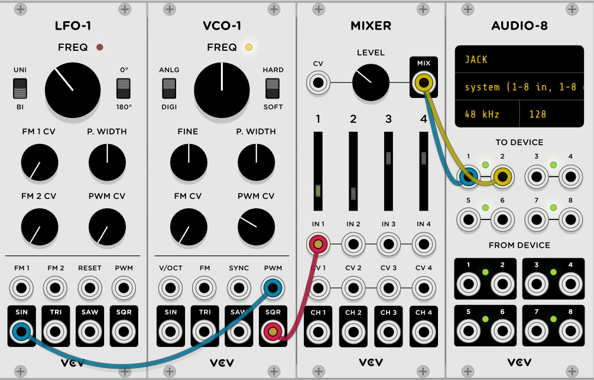
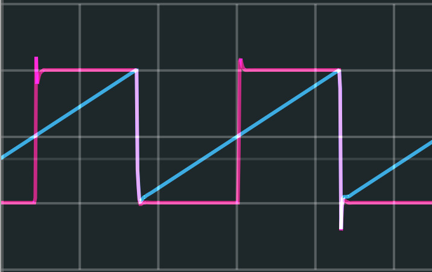

# Methods of making noise

## Samples

> a snippet of a .wav file open in audacity

A sample is exactly as the name implies- a 'sample' of audio. Sample is a pretty broad term though, so usually some more terms are applied to help categorize them. The easiest to explain is what is usually meant by sample: a small audio file that contains one sound, like one drum hit or one piano key press. These can either be samples made or collected for the sole purpose of use in later music (like hitting record, playing one drum hit, then stopping, to create a small drum sample) or a sample lifted (with often dubious legality) from another recording. It's worth noting that fair use is really not something you can rely on here, but it's also pretty common. #notlegaladvice

The next kind of sample worth looking at is a loop. These are longer and are usually, well, loopable. If you play them on repeat they typically sound continuous. Often these will be of drums or guitar. The term 'loop' is often used broadly for audio snippets of this length though, so not all loops loop. Usually when using a loop it's best to do some mangling, swapping some beats or putting on destructive effects to transform it in some way. This prevents your audio from just sounding like layered tracks from another artist mashed together and is a good way to put creativity into what you make.  

Another term you might hear are stems. Stems are just separate recordings of each part of a song - say the vocals as one audio file and the drums as another, these would make up the stems. 



Samples are also, sort of ironically, made of samples. But these words mean two different things in that sentence. The sample of sound is made up digitally of a bunch of different points in a wave, usually captured ~44 thousand times a second- whatever the sampling rate is (commonly 44.1, 48, or 96 <a class="ptr">(1)</a>). This is what gives us the image above, where the originally pretty smooth looking wave, when zoomed in, we can see is made of these discrete points. 

This is particularly relevant to making music for multiple reasons: 

* When change the speed/pitch by a non integer value, we have to 'interpolate' extra points into this.
* When we slow down or make a sample lower pitch there's only so much data to use, at really low pitches the wave will start to sound sort of low-fi
* When chopping a sample to start playback at any point, we want to chop at a 0-crossing to avoid a sharp transition (which equates to high pitch sound)

<ol hidden id="footnotes">
    <li>The Nyquist-Shannon Sampling Therom <a href="https://en.wikipedia.org/wiki/Nyquist–Shannon_sampling_theorem">(Wikipedia)</a> , put very basically, just says your sampling rate needs to be twice as high as the highest frequency in your source to be reproduced exactly. Because human hearing ranges roughly from 20 to 20khz, sampling at 40khz or above should be sufficient. Unfortunately, there's more too it than that, especially as generating waves in a virtual synth can benefit in sound quality for various reason from 'oversampling' - running above 44.1 or 48khz. Unfortunately, the higher the sampling rate the more work the computer has to do.
    </li>
</ol>

<--->

> Zoomed in view of the snipped, showing the individual points in the sample



> Bitwig Studio's Sampler. Here pitch tracking is enabled, making it so the sample can be played sped up or slowed down to pitch chromatically along the keyboard. Bitwig's Sampler is pretty similar to many other samplers in other DAWs like Ableton Live or modules like Simpliciter In VCV rack

Here, we're looking at the sampler device in in Bitwig Studio, though most of this should be similar in other software. Starting with the obvious, the sample wave form in the middle. Here I have loaded a sample ([TODO, new picture, .wav]) which has multiple drum sound in it, but I've zoomed in on one sample and placed these yellow flags to denote the start an end points. Bitwig's sampler, like many others, will try to snap these points to aforementioned zero crossings.  You'll also see next to the file name that the keyboard icon is blue and says 100% and next to that the root is set to C3. This means that if I play the C3 key on my keyboard it will play the sample as is, but if I play a different key it will slow playback down or speed playback up to match the pitch to the key I'm playing. The root being C3 is because, say I hit and recorded the A4 key on my piano- it's nice to be able to correct for the pitch of the sample in the keyboard tracking.

Still in the same section of the window but at the bottom now you'll see two icons for the flags with '[TODO]' time between them and after them, these are the times in the sample where the start and end flags are placed. Left of that you'll also see an arrow with an R over it, that's the button to tell it you want to play the sample in reverse.

[TODO, a lot to go here]

> 'Simpliciter' module in VCV rack, a sampler with transient detection, Sound On Sound (SOS) looping, and variable speed (pitch) playback

start, stop, fade, pitch shift, (ableton simpler)Live Input

quantization, tracking

### Field Recordings, Tape Loops, and other sampling goodness

https://soundslikenoise.org

## Basic Oscillators

Generally there are a few kinds of oscillators you should know about, but first, what's an oscillator?

Well, very simply, it's a thing that oscillates- moves in a repeating pattern. Generally there are three ways you'll hear Oscillators refereed to as being VCO, DCO, or LFO. You may also see Oscillators in general refereed to with the abbreviation osc. Unfortunately, that can be confusing because OSC can also mean Open Sound Control, something I'll get into in the Sequencing and MIDI chapter in a bit.

A **VCO** is a Voltage Controlled Oscillator. Back in VCV you saw these being emulated where each volt of constant input applied made the oscillator oscillator at twice the speed, one octave higher. In real life, VCOs tend to be a bit unstable and have minor pitch drift. While this may sound like a negative, it's generally seen as a feature, as stacked, slightly out of tune oscillators sound really good. In fact, VCV Rack's basic VCO, 'VCO-1', emulates this behavior by default.

A **DCO** is a Digitally Controlled Oscillator. These (usually) exhibit no pitch drift and are far easier to tune.

Note that some hardware may go from a digital input to a VCO internally, or take a voltage pitch signal as input but just sample it to use a DCO internally.

an **LFO** is a Low Frequency Oscillator, they can still be either digital or analog (DCO or VCO), but they typically have a max frequency of around a hundred hertz and are meant to be used to control other things, not make sound to hear directly. 

Oscillators usually have very simple wave shapes as outputs. Typically, you'll see Sine ∿ , Triangle ʌ , Square ⎍ , and Saw waves as outputs. You may see other, more exotic wave forms though.

Often, the square wave output has PWM or 'Pulse Width Modulation' control:

Varying the pulse width over time sounds really good, to give it a shot try setting this up in VCV:



Here I've set the LFO to be bi-polar with the switch on the left, and VCO-1's PWM CV knob has been turned up to make the input do something.



Some oscillators will also have Sync, either Hard or Soft. Sync, in general, makes the waveform reset once it gets an input from another oscillator. This means you'll need two oscillators to do sync.

> **Oscillator sync** is a feature in some synthesizers with two or more VCOs, DCOs, or "virtual" oscillators. As one oscillator finishes a cycle, it resets the period of another oscillator, forcing the latter to have the same [base frequency](https://en.wikipedia.org/wiki/Frequency).
>
> [For Hard Sync] If the [following oscillator] is tuned to a lower frequency than the [controlling oscillator] it will be forced to repeat before it completes an entire cycle, and if it is tuned to a higher frequency it will be forced to repeat partway through a second or third cycle.
>
> [...] There are several other kinds of sync which may also be called Soft Sync.
>
> **Reversing Sync**
>
> This form of oscillator sync is less common. This form is very similar to Hard Sync, with one small difference. In Reversing Soft Sync, rather than resetting to zero, the wave is inverted; that is, its direction is reversed. Reversing Soft Sync is more associated with analog triangle core oscillators than analog sawtooth core oscillators.
>
> **Threshold or Weak Sync**
>
> Several kinds of Soft Sync use comparison thresholds:
>
> - Hard Sync which is disabled when the frequency or amplitude of the slave crosses a user-defined threshold.
> - Hard Sync which is disabled when the frequency of the [following oscillator] extends too high above or too far below the frequency of the [leading oscillator].
> - Hard Sync which is disabled when the frequency of the [following oscillator] is lower than the frequency of the [leading oscillator].
>
> Soft Sync may accurately refer to any of these, depending on the synthesizer or manufacturer in question.
>
> **Phase Advance 'Sync'**
>
> The phase of the slave is advanced by some amount when the [leading] oscillator level crosses some threshold. Used for audio synthesis, this may give an audible effect similar to Soft Sync.
>
> **Reset Inhibit Sync**
>
> When the [leading] oscillator crosses some threshold, the normal reset of the [following oscillator] is disabled: it will stick at its final level, positive or negative. When the [leader] crosses back over some threshold, the [following oscillator] is reset.
>
> **Overlap Sync**
>
> In this method, the current wave completes but a new waveform is generated at the sync pulse. The tail of the old wave and the new wave are output summed if they overlap.



https://en.wikipedia.org/wiki/Oscillator_sync



I'd also like to briefly mention oscillator cores. Especially in VCOs, knowing what the 'core' of an oscillator is can make a difference. The core is simply the waveform from which the other waveform are derived. Generally, there are three kinds you'll see (though others are possible): Triangle, Saw, and Trapezoid core. To get an idea of what a core is, lets look at the saw.

You can think of making a saw wave as just progressively counting higher with time. So, at t=0, we start at 0, at t=1 we go to 1, etc. until at, let's say t=10, we reset back to 0, and count back up to 10. If we assume this process is continuous, that is we could look at any decimal, like at t=1.12 the wave is at 1.12, we've generated a sawtooth wave. This is our core. Now, we can say whenever that 'core' wave is less than 5, output 0 on the square output. If it's greater than 5, output 10. If the blue wave is that core oscilator, the pink wave is the result (ignore the awkward spikes at the transition points)

 

The core used will often change the features of the oscillator. Generally, saw core oscillators are the cheapest and most common but also the least capable. Triangle and trapezoid cores often offer extra features, such as outputs other than the common sine, tri, saw, square. 

Finally, I'd like to bring up harmonics.

The really dumb version: If the wave has quick transitions (cliffs, ridges, etc) it's going to be more harmonically rich, and therefore have more 'sonic content' above the base frequency. For example, say you play a 440hz sine wave. It will have no harmonics, it will be a pure, 440hz tone. But, if you play a 440hz square wave?  That'll have a ton of harmonics, actually, by definition, it will have **odd** harmonics. If you care about the mathy stuff you can read [An Interactive Introduction to Fourier Transforms by
Jez Swanson](http://www.jezzamon.com/fourier/). But, the relevant bit for for musical stuff is that these harmonics, the phase relationship between them, and how they change over time is what makes a sound sound like *that sound*. It's what makes a piano sound like a piano, etc.

Anyway, knowing what these harmonics add to a sound make a big difference. Often with synths, you'll find you have separate control or outputs of the even and odd harmonics. This is sort of what you expect.

For example, say we have a 100hz 'base' sound. Then the even harmonics would be 200, 400, 600, 800, etc. Odd harmonics will be at 300, 500, 700, etc. Note that humans can only hear up to 20,000 hertz anyway, so, technically it's impossible for you to hear a true square wave (Well, technically a *true* square wave would have infinite energy, so it's impossible for more than one reason). 

I'll spare you going any deeper into terminology like the difference between harmonics and overtones, but, and here's the important parts:

* Even harmonics have the perfect octaves and 5th, while odd harmonics have 3rds- which turns into dominant seventh chords
* If you add in a lower harmonic (say you have a sub-octave pedal on your guitar) your brain will (usually) perceive the note as being the lowest frequency in that harmonic series available
* Distortion is literally just adding harmonics to the sound, clipping a sine wave (a form of distortion) is a really easy way to see this

<iframe width="100%" height="500" src="https://www.youtube.com/embed/Wx_kugSemfY" frameborder="0" allow="accelerometer; autoplay; clipboard-write; encrypted-media; gyroscope; picture-in-picture" allowfullscreen></iframe>

## Additive and Subtractive Synthesis

<iframe width="100%" height="500" src="https://www.youtube.com/embed/videoseries?list=PLrnjie9klQEkZGar3zZ4hRurU_kUDk7Md" frameborder="0" allow="accelerometer; autoplay; clipboard-write; encrypted-media; gyroscope; picture-in-picture" allowfullscreen></iframe>

[TODO] making a basic subtractive synth voice in VCV

## Wavetables

<iframe width="100%" height="500" src="https://www.youtube.com/embed/8DjnDVWKaEs" frameborder="0" allow="accelerometer; autoplay; clipboard-write; encrypted-media; gyroscope; picture-in-picture" allowfullscreen></iframe>

Note, that not all wavetables have the linear FM (discussed in the next section), Phase mod / distortion, and wavefolding that pigments has, though many do.

I really reccomend using [Blamsoft's XFX-Wave](https://blamsoft.com/vcv-rack/xfx-wave/) for VCV rack to try out Wavetable synthesis. Also in VCV, [Tiny Tricks Wave](https://library.vcvrack.com/TinyTricks/WAVE) is a neat way to experiment with recording your own tables.

[TODO pic of both]

## FM Synthesis

> [Source (Likely originally from the Yahmaha DX7 Manual)](https://scsynth.org/t/coding-fm-synthesis-algorithms/1381)

Frequency Modulation or FM, is just the simply when you let the output of one oscillator modulate the frequency of another oscillator. Usually this is done in simple ratios and, ideals, uses linear, through zero modulation.

First, Let's start with linear vs exponential FM. It's worth noting that most pitch tracking is exponential since our music system itself is inherently exponential (each octave is a doubling, that is the frequency between C5 and C4 is twice the frequency between C3 and C4). This causes a problem though, if we modulate with exponential FM, say with a sine wave that is +/- 1V (2Vpp) and we start with an A4 at 440hz, then we'll swing up to 880hz and down to 220hz. Fine right? Not so much. If this modulation is meant to simply give us a more harmonically interesting A as we mix in different octaves that won't be the effect, as now we're (to oversimplify) at 880hz half the time and 220hz half the time, and if we average those $\frac{880+220}{2}$ then we don't still get the original A 440hz but rather we get 550Hz, so, we've detuned. Linear FM won't be able to follow the V/Oct standard (though some may use the Hz/V standard) but will keep you in tune as you modulate. This, however, begins to pose a more interesting problem. Imagine you want to modulate a 100hz signal by +/- 200hz. Clearly, that would mean going as high as 300hz, but what happens when we get past the first half of that negative signal and hit 0hz? Well, this is where having a Though Zero FM (TZFM) capability comes in handy, as this issue is solved sonically by actually inverting the phase of the signal when crossing the 0Hz point. While this may seem an odd solution, it does produce sounds that line up with what our ears expect.

Exponential FM and V/Oct, assuming the same scaling, are the same thing though so sometimes you can actually view it more as a second V/Oct input. For example, you could use the Exp FM input to specify the note, and then the normal V/Oct input to change the octave. Of note however, this may not always work as the Exp FM input may be AC coupled, meaning that DC values, like note data, will not be able to get through and instead you'll just hear a "ping" as the pitch is modulated at the cutoff of the AC coupling filter, in these cases the Exp FM input will have a minimum frequency that the input signal can oscillate at to perform properly. 

When talking about Linear FM, I mentioned that simple ratios are best. This isn't entirely true, but they will produce the least complicated harmonics. For example taking

<iframe width="100%" height="500" src="https://www.youtube.com/embed/L1QZuEuMD_E" frameborder="0" allow="accelerometer; autoplay; clipboard-write; encrypted-media; gyroscope; picture-in-picture" allowfullscreen></iframe>

[Todo, Why simple ratios]

[Todo, Algorithms]

[TODO, pic of Valley's Dexter]

[TODO] DIY FM voice in VCV

## Granular Synthesis

There are many, many granular synths and effects, but, I'd like to start with a video review from Loopop of the Tasty Chips GR-1, as I think the hardware does a good job of showing what's going on and Loopop does a great job explaining as well:

<iframe width="100%" height="500" src="https://www.youtube.com/embed/1RWOoEj3mwU" frameborder="0" allow="accelerometer; autoplay; clipboard-write; encrypted-media; gyroscope; picture-in-picture" allowfullscreen></iframe>

[TODO] use for textures