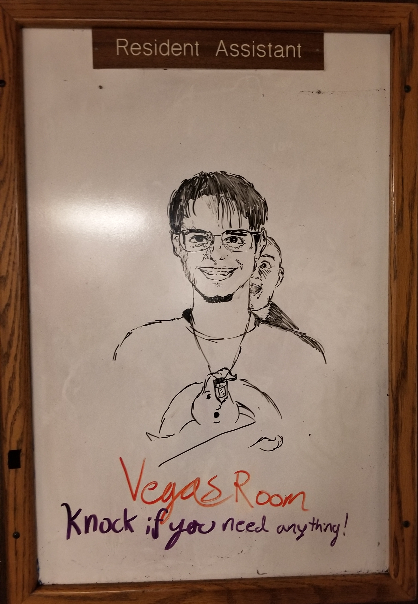

**THIS PAGE IS A DRAFT.**



ensign_beedrill, [CC BY-SA 2.0](https://creativecommons.org/licenses/by-sa/2.0), via Wikimedia Commons



I am currently a student at the University of Nebraska - Lincoln, where I study Computer and Electrical Engineering (dual major). I have a serious passion for both of these subjects, which is why I am so incredibly frustrated at how negitive my experiance at UNL has been, espically in the classes the directly relate to my major. This frustration is a large part of why I started OpGuides, so I thought I'd share it with the world.



This article's purpose is highlight the shortcomings of my college experiance. While I am going to try to summarize each semester, there is no way I can possibly capture all of my daily struggles and frustrations or possibly mention all the great people that have helped me along the way. Nor can I possibly put into words the vaule of the friendships I have made, the joy that I've had at some university hosted events, and some of the amazing benefits that come with college that are not academic. I also can't fully provide context about what was going on in my life or what personal achievments or projects I was working on at any given time. This is a huge span of time to try to sum up.





As I was previously employed by UNL as a Resident Assistant, the standard disclaimer of "The views experssed in this article are strictly my own. This article does not reflect the view of any of my employers, past, present, or future" applies.  Furthermore, I may update this same article in the future. This may happen as I remember things from the past and as I finish up my time at UNL.



## 0 - The End of High School

I **hated** high school. I never quite fit in with anyone, I was the class tech-nerd, openly bi, and not into sports at a school that lived and breathed sports. Still, I served my time and got though. While there, I took a dual credit class that transfered in for an English credit, with an amazing professor, Carolyn Nolte. I also took the ACT three times and got a 27 all three tries. ([Fuck the ACT btw](https://www.youtube.com/watch?v=J6lyURyVz7k))

Being total garbage at foriegn language, liking the experinaces I'd had with Arduinos, and having a brother that was still persuing a degree in Mechanical Engineering at UNL, I choose to dual major Electrical and Computer Engineering.

## 1 - Freshman, Fall '16

The story starts with move in, as I finally meet my roomate for the next year, though we'd already talked a bit on Facebook. We're both CompE's, and there's actualy a few other CompSci's on the 7th floor with us. We're all excited for college, have no idea where our classes are, and have no idea what the next few years will actually have in store.



Me, freshman year, rocking some questionable long hair



Freshman year feelis like ancient history now, but some of it still stands out. A lot of stories, a lot of scars I earned as I learned to longboard so I could make it between my classes fast enough. As for classes:

* C programming:

  Painfully slow, but it was also a 100 level course so ╮(─▽─)╭, my roomate was also taking the course and failed, but I got an A+. He partied, did stupid shit, and eventually dropped out, so I suppose it still served as a basic weed-out class, which I dont necessarily see as a bad thing. That said, I do wish the class had gone a bit more in depth. I don't think I ever wrote code that topped 100 lines in this class.

* Interpersonal Skills 

  I had to do some volunteering, where my 'interpersonal skills' were tested by helping teach adults *very* basic math. Fun times. When talking about stereotypes the prof said I look like someone that smokes weed because of my (at the time) long hair, I got asked if I sold weed by students looking to buy after class.

* Calc Ⅰ 

  Tought by a prof that seemed like he didn't want to be there, and made frequent mistakes on the whiteboard. Fortunately my TA for the recesitation was, and I can't stress this enough, *amazing*. Thank you Jessalyn Bolkema for making tha class as good as you did, and for helping inspire me to see more beauty in math.

  In Calc Ⅰ I also had somebody put gum in my hair so bad that I had to get a hair cut. So, those beautiful locks you see above were short lived.

* History of Rock 

  Great class, great prof, lots of fun. The tests got oddly specific, but whatever. About a year later I met up with the prof to put an accelormeter hooked up to an Arduino into the back of his guitar for controlling MIDI effects, but that's about the most relevent thing to my majors that came of it.

The actuall 'college experiance' was actually pretty good this semester. I only had to chop off one arm to pay for books with online codes attached that I prevented buying used. Living with a roomate wasn't *quite* as bad as people said it would be (still pretty much sucked)

Oh, the cazy preechers on campus were definitely a great way to round out the college experiance.

<iframe width="100%" height="500" src="https://www.youtube.com/embed/cZe1rdvCrWk" frameborder="0" allow="accelerometer; autoplay; clipboard-write; encrypted-media; gyroscope; picture-in-picture" allowfullscreen></iframe>



The cheering at 6:38ish is from when I kissed my BF infront of the homophoic asshat, good times. (Yes, the video is broken)



There were many, many more times like this with differnt groups (This is 'Brother Jed', but 'Pastor Tom' would swing by to be a douche regularly, and there were a few others too- I don't at all think these people are reflective of Chirstianity, just a bunch of idiots.)

## 2 - Freshman, Spring '17

* Comp Sci Ⅱ 

  Pretty hard, required a lot of late nights up programming, but the prof was really good. I may hate Java, but the class was done well. (Thanks [Dr. Bourke](https://www.youtube.com/user/cbourke3)!)

* Unix Programming

  Completely useless, I mean, even for a 1 credit hour class, it was so painfully basic that it was basically irrelivent, It went over bash scripting but failed to explain any of the fundamentals of the *nix fs structure, what /sys and /dev are, etc. plus it lacked any meta programming like Makefiles and what not.

* SciFi literature

  Great class that I actually really enjoyed. Again, it made no difference for my major beside fullfilling a gen-ed requirement. I actually had a lot of fun in the class, but the prof was painfully awkward, to the point where one day I'm not 10000% sure I didn't encounter an awkward [Title IX](https://en.wikipedia.org/wiki/Title_IX)-y situation when the prof told my at-the-time girlfriend and I that he had a dream about us. (゜_゜;) like, *excuse me*, what the *fuck*. 

I was dealing with quite a few personal issuses this semester, which made the stress of Calc Ⅱ and Physics Ⅰ unbarable. I withdrew from Physics and got a C- in CalcⅡ, which meant I needed to retake it.

The reason I choose to drop Physcis was two fold, for one, the class was my hardest and so made the most sense if I needed the lighter load, but the bigger reason? I couldn't follow the lectures though the prof's and TA's accents. Very thick russian and chineese respectively, and it was just not going to work. The textbook cost a few of my remaining limbs and couldn't be avoided for a online code, which I would later need to re-buy (thankfully only the online code since I had bought it before) when I took the class later. 

## 3 - Sophomore, Fall '17

* Chem Ⅰ 

  Not really noteworthy, I found it difficult, as did most people as, if I recal correctly, the pass rate was abysmal. The prof was fine, the lab was fine, and everything was 'fine', just the content was fast paced and difficult. The final was a standardized American Chemical Society final, which I found oddly disconnected from the course and hard as hell, but I passed the class with a B and was able to move on with my life. I did find some complaints from when I took the class that I had expressed to a group of engineers:

> There are 3 different books we need (Textbook, recestation book, lab book) all of which have related online materials and all of which require seperate logins and access codes on different websites. All of these are seperate from the actual course webpage. But, I can deal with that. What has me angry is this first prelab I just did on one of said websites. Multiple of the questions have no correct answer or multiple correct answers, one is worded in a way that doesn't even make sense (despite the quesiton they were trying to ask being obvious so I got it anyways), and yet another doesn't even tell you how the answer should be formatted on the page (do I include units?).

* Computer Organizaiton

  Ho-boy, now we're hitting the realy what-the-fuck stuff. According to my record I passed this with a C+ and that's the biggest grade inflations the world ever did see, most of the class got out with C's after a similar curve that stopped them from outright failing. My grade on the first test- a whopping 27%, and the high was a 32% (iirc?). The prof, while the sweetest old man I have ever met in my life and I would happily spend hours with just talking to, had some sort of neurodegeneration disease and in his old age should not have been teaching. This meant that instead, the TA's picked up the slack. There were 5 TA's I think? Only 1 really knew what he was doing though, and he showed up to class **DRUNK** a few times. I was actually really into learning about computer architecture before this class so sortta had a better idea of what I was doing than most, so for one of the TA-lead classes where the TA that knew what he was doing was too hungover to attend one of the other TA's *asked me to teach it*. Just let that one sink in a little bit.

  Eventually, the department got involved, a second prof was brought in to attempt to un-fuck things, but that went about as well as you'd think it would 3/4 though a semester, so they ended up just scaling the fuck out of our grades.

  The other odd thing was the room where some of that class was taught- the desks were literally falling apart. One day I had to bring in a screw driver and I went around fixing everyone's desks thoughout the lecture because the University wouldn't.

* Calc Ⅱ (Redo)

  Calc Ⅱ went better this time, I got though with a B+ and could move on with things. My TA for the class, Dylan McKnight, was amazing, despite the fact that I didn't do well, I honestly can't fault the instruction. Again, Dylan inspired me see the cool side of math, and he was pretty cool himself, fully understanding of the multiple times I came into class bloddied up from ~~biffing it on my longboard on my way into class.~~ being attacked by chainsaw weilding bears.

* Power and Politics in America

   Surpsiningly chill for being in Fall of '17 after the election of Drumpf. Prof was good, no real complaints.

I commuted to class this semester, which meant about 40 min to campus and the same back. Combined with CalcⅡ being at 8:30am, this was not awesome.



<--->

On the bright side, I did get to flip off some more asshats telling people they were going to hell for being gay (ʃƪ ˘ ³˘)



## 4 - Sophomore, Spring '18

* Chem Ⅱ

  Nothing woth saying really. Hard as hell, but I got though ヽ（´ー｀）┌

* Calc Ⅲ 

  Fine, if a bit tough.

* Discrete Math

  "Meh". I again had the amazing Dr. Bourke, but the class had a lot of fluff that I don't think I'll ever actually find useful.

* Circuits

  Oh boy, the prof was the most monotone guy I have ever met, I'm not convinced he didn't have a signal generator locked on a specific frequency in his throat and just did AM on it. Also, I hate to have to tell him this, but there is a differnce between a Turban and a Turbine. Anyway, the class was literally half just resistor networks and using nodal and mesh analysis on these circuits. We did eventuall get to reallllly basic capacitor and inductor circuits, ending with just the smallest mention of the diode. The class was slow, we never even really talked about how simulation software could be used, and it was just... not good. I think this complaint mostly boils down to expecting some *practicality* in my courses, which is apparently too much to ask for.

The Lab? The lab was worse. This TA has given me a story so stupid it hurts.

This, is an ohmmeter, it measures *resistance* in *ohms*. Not Impedance. This TA, in his glorious idiocracy, told the class to use a much more expensive, digital, high percision ohm meter to measure the *impedance* of an element in the circuit using the *ohm meter* while the cirucit was **powered on**. And look, I'm not going to go into all the mental hurdals of incredible idicoracy at play there, but trust me, this is 110% distilled stupid. So, I raised my hand and told him that this was wrong, thinking that as he's a Graduate TA (GTA) that, maybe, he'd just had a lapse in judgement and that he'd be thankful I pointed it out before everyone in the lab either blew fuses or damaged things outright.

Nope. This guy wants to fight.

This was years ago, so obviously this is not exact:

> **You can't measure impedance with an ohmeter**
>
> Yes you can. I'm the Graduate TA here, you need to listen to me
>
> **I'm really not comfortable doing this sir, I think it can damage equipment**
>
> You don't know what you're talking about, you're taking Circuits one after all.

⏸️Pause. Dude. Really. This is like the 4th lab at this point, you've had plenty of time to realize by now that I finish these labs early consistantly, I wear a vaccumm tube around my neck, and that I'm coming into class on a longboard burnt with high voltage. You probably shouldn't have said that.

> **Can you explain to me how the equipment works then? Becasue from my understanding about how an ohmmeter works interally this will not give a correct read out, and can damage the equipment**
>
> This is an intro course, you don't need to know that. Do as I say.
>
> **Nobody in this room should follow those instructions unless you want to be replacing fuses for the next hour.**
>
> You have no idea what you're doing!

Okay, now I'm sorta pissed. This is **not** what a TA should do. TA's are supposed to help you and encourage you, explain any questions you might have away. He's not explaining, he's demanding repsect *and* demeaning me. Fuck this guy.

> **No, you don't know what you're doing.**
>
> (now screaming at me in the lab) How dare you say that to your TA, and a grad student at that! Come talk to me privately in the hall!
>
> **No. Anything you have to say can be said here.**
>
> Fine, then let's go talk to [The Lab Lead]!

At this point, I'm literally laughing at this guy, he's red in the face from screaming, and I'm just chill. We get up to the lab leads office, the guy who is also responsible for fixing equipment, and the GTA tells hid story of how I'm a disrespectful little shit, somehow leaving out what started the entire thing- him almost getting people to blow fuses on equipment. After he's done making his case, while I smile and play with the tube around my neck and lean on my 10kv burnt long-board, I tell the lab lead what we're actually up here about, that this GTA wanted us to **measure impedance, with an ohmeter, on a live circuit**. Lab Lead, I shit you not, looks at the GTA and just says "Are you serious?" then ripped the dude a new one. 11/10.

This did *not* get better, at all, though the semester. I basically ended up teaching my lab.

This semester I was also a Resident Assistant at UNL. Because of the legallity of discussing anything about that, I'm choosing to not talk about the experiance directly, though my next semester an an RA left an even more sour taste in my mouth than this one did.

During this time UNL did have an incident with a [Racist](https://journalstar.com/news/local/education/unl-students-voice-frustration-over-administrations-lack-of-action-against-white-nationalist/article_2f83d453-5f66-58f3-a0df-32af4d50e625.html) [Douchebag](http://www.dailynebraskan.com/news/unl-chancellor-says-daniel-kleve-is-protected-by-first-amendment/article_54a064ee-0cee-11e8-ad7b-ef1f3a068da6.html) to which they respond by ... giving everyone free "Hate Will Never Win" T-shirts instead of doing something actually meaningful. Cool.

## 5 - Junior, Fall '18

* Data Structures & Algorithms

  'Algos was odd. The class did make me a better programmer, but it had some really annoying issues. Primarily, the lectures were often repeats, sometimes up to 3 or 4 times of covering *exactly* the same material. This got old very quickly.

* Circuits Ⅱ

  Same prof as before, still just as monotone, but this time the class picked up in pace, possibly a bit too much, and still lacked doing things with Spice or other sim tools, lab was still very meh. Lots of focus on big, power electronics. Not my cup of tea.

* Technical Communicaiton

  just.... not good? This class largely felt like busy work, and for the final presentation we had to give for the class, my partner just up n' disapeared on me, leaving me to do it myself.

* Differential Equations

  This class was a mixed bag, on one hand, the prof was amazing (Thank you Dr. Laubmeier). It was her first semester teaching but she *nailed* it. On the other hand, something about the subject just absolutely failed to 'click' with me, so while I could work though the problems, I felt like it was all sorta magic? I don't know how else to put it. Regardless, this is 100% on me.

This semester I was also a Resident Assistant at UNL again. I still can't say much about this as I'd like; however, I will say that the entire experiance as an RA made me feel that, despite the dorms existing as housing at an educational institution and the fact that I was in the dorm that was primarily used for honors students, the dorms were anything but conductive to education. Music majors couldn't use electric amps in the music room and nobody was allowed to have anything that wasn't UL certified in their rooms- there goes everything from 3D printers to any lab equipment. And like, yeah, I get it, but come on? I also felt that I was not respected as a person, as despite my request that I be stationed literally anywhere else in the building on account of my bad knee, I was assigned a room on the fourth floor of a building with no elevator. Their response to LGBT issuses also left me unhappy, as on oppisite-sex guest wasn't allowed overnight... yeah. Let that one sink in, it's somehow more restrictive to straight people yet more offensive to LGBT people. Way to go guys.

## 6 - Junior, Spring '19

I had a lot going on outside of school, so I intentionally took a rather chill semester,

* CPR and Archey

  Both were taken just to fill credit hours, to get up to the required 12 to be a full time student. CPR was a total of three 1 hour classses, while Archery was a weekly 3ish hour session and was really cool, even if I was comically bad at it.

* Embedded System

  I yet again had a professor for which it was his first semester teaching. He was... not great. We used the Arudino Uno and built a tiny wall-avoiding robot and did a few other labs, and... cool, I guess? It was the kinda thing that should be tought in highschool, not college. We (mostly) didn't use the Arduino framework, instead poking registers directly, which made the class a bit more valuable, but still, I found it a bit lack luster. I often found that I knew more about the 328p CPU and it's features, debuggers and simulators that were available, etc. than the prof did. I have heard the prof has since gotten a lot better at teaching though, and one of my good friends had a really good experiance taking the advanced varient of the course with him, where he used an FPGA instead of an μC.

* Physics Ⅰ (Actually taking it this time instead of withdrawing early)

  I had a really good TA (who I am still friends with!) and having the better math background really helped, which is most of the reason I put it off for so long, pulled a B+ out of it so 👍.

* Philosophy

  This class? Well it was an experiance. It was 5pm to 8pm iirc, and trying to force yourself to care about basic philosophy for three hours straight is a bit brutal. I did find the class interesting though and am glad I took it. Plus, the 10 minute break the prof allowed in the middle was just barely enough for me to max-speed penny board to Wendy's, grab a meal to go and scarf it down before he started teaching again.

## 7 - Senior, Fall '19

* Physics Ⅱ

  Pretty awful. I wasn't stoked with the instruction (from the prof, again, TA was bomb) in PhysicsⅠ, and it went downhill in Ⅱ. My TA had a pretty thick accent, which made understanding him difficult. The Lab, well, the equipment was all electrical taped together and should have been thrown out 20 years ago. I found this particularly odd, as the chemistry department's labs were top notch, like, each lab room had 6 TVs so that every lab station could look at the slides/insturctions independently even. It was seriously overkill. Then, we have these physics labs that are struggling to get by on scraps. ¯\\\_(ツ)_/¯

* Circuits Ⅲ 

  This class was an absolute dumpster fire. The prof is by far the worst I've had my entire time at UNHell. He made crazy assumptions about the prior knowledge of students, dove *way* to deep into semiconductor physics instead of how to actually use them, miserably failed to explain things, assigned homework that was insanely long, gave tests that were more a test of what you had written on your allowed cheat-sheet, and at one point even told the class a test was going to be over the wrong thing- making it so that he had to give a make-up test. He was also just kind of unpersonable and unwelcoming. While my experiance was already horrible, I had friends that had far worse. I still don't understand how to use tranistors in a circuit very well, and if anything I think this class made that situation worse. If I were rating my classes out of 10, this one would get a negitive score.

* Linear Algebra

  Really good class, taught incredibly well by Dr. Laubmeier, and I am again greatful for the experiance.

* Signals and Systems

  Taught by Dr. Khalid Sayood, this class was probably my **best** experiance at UNL. Don't get me wrong, that class was tough, but I have never had a prof so skilled at teaching, so invested in his students, and so down to earth. Learning from Dr. Sayood will almost certainly stand out as the highlight of my time at UNL.

## 8 - Senior, Spring '20

> Operating System Kernels, EE Lab Ⅰ, Digital Logic Desgin + Lab, Philsophy and Current Issuses



This semester is the one that COVID-19 hit. The last half-ish of this semester had otherwise normall classes transitioning to being entirely online. This went about as well as could be expected. Obviously, this is a rather odd scenario. It may not be fair to judge the University based on the response to this necessarily; however, I think that seeing how the university responds to this shows how they'll respond to other things- that is to say poorly.



## 9 - Senior+, Fall '20

> Electromagnetic Field Theory, Probability Theory, Communication Networks, Software Engineering

## 10 - Senior+, Spring '21

> 

# Conclusion

​	Don't misinterpret this as me whining my classes are hard. I **prefer** my classes be difficult. I'm paying to sit in that seat, and if something is easy that means I'm not learning. The issue is that a large portion of my classes have been taught with incompetence, and that I'm learning how to do things the way they've always been done instead of the way they are done now. Progress and change is exponential, while humans ability to adapt and react is, and always has been, linear. Everyone knows just how crazy it is that we all have a computer that's powerful enough to handle realistic looking 3D graphics in our pockets, yet, for some reason, despite this being at this point a universal tool, we still do math by hand? Does this make sense? All progress though out history has been because people built on top of previous advancements and have abstracted away that problem. When GM builds a car they don't reinvent the wheel, nor do they design and build every robot used for automation in house. Why when I try to solve a complicated system of equations would I not use a program that can do it for me? Sure, make sure I have the knowledge necessary to use those tools proficiently and know when the tool has acted up, but a mechanic doesn't need to know how to make a drill; Why should I need to know how to estimate and nth order differential equation when a computer can give me a solution that is much more accurate, avoids any possibility of an algebra or calculus mistake, and can do it comparatively instantly? Maybe to impliment this code to beign with, but if that's the case, then have me do that! The phones we all carry around also give us immediate access to the worlds largest wealth of information. Why should any one care to memorize what year The Beatles released Abby Road (History of Rock) or what years the parties in this US flipped in opinion (Political Science)? I should know of these things, but I shouldn't need to know the specifics, because after a test, I can assure none but the most die hard of those fields with the most extreme of narrow interests on those topics will remember. But even beyond that, why would I care to know the best algorithm for some weird data structure off the top of my head? If I need to find out I'll Google it, just like a professional at any workplace will do after they've forgotten less than one year after graduation. Instead, we should be learning about the broad field, and diving into the specifics with applications to help better our ability to choose the best algortithm or method or tool.

​	Right now, my classes are hard, yet I have a passion for what I do. I love programming and designing circuits, but some how UNL has managed to teach these things in ways that at times make me despise them.

​	College, and education as a whole really, needs to shift. Two decades ago when, when I was born, it may have made sense to teach like this. But for those of us that are actually passionate about what we do, being forced to sit though explanations of concepts that will not be relevant beyond the next homework assignment where, at best, only a hypothetical situation in which this may be a solution may be proposed, or at worst we are forced to do a problem that is nonsense if done in reality for the sake of a grade. That's not education. That's a form of punishment. If the goal is truly to educate, to show students new view points, and to help these people that are mankind's hope for a better tomorrow, then we need to teach them like it. People taught to solve yesterday's problems will at best solve today's problems. We need more. We deserve more. Everyone deserves an education that prepare's them for tomorrows problems, especially when we're going into debt to get it.

​	I'm not going to propose a single solution, because I'm not qualified to do that. But, then again, that's kind of the point. Specialization is necessary, and while it used to be that even to specialize you needed to have a reasonably deep understanding of many, many things so you could communicate effectively now when you need to double check some fact when talking to someone in an adjacent field it takes 30 seconds to search instead of needing to keep it all stored in your gray matter. Instead of having a Computer engineer take low level chemistry (assuming they are not specializing in post silicon semi conductors) why not provide a nice overview of the topics that would be covered as well as their potential application and common pitfalls?

​	As things are right now I regularly talk to computer science and computer engineering students who don't even have this broad knowledge of their own field yet for some reason they have in depth knowledge of adjacent fields. I don't see any way this can possibly be justified.

​	I have seen friends switch majors because of what looked to me to be a distaste in the teaching style and this aforementioned outdated style of education instead of it being because they truly would be happier in the new major. I've talked to countless people who have incredible ideas with no way to pursue them because in order to have 12 credit hours to be a full time student they have to take on so much busy work that these ideas fade into exactly that, ideas. Ideas to never be realized. And what do they get in return, what is the payoff for this sacrifice? The can now estimate a complicated differential equation by hand with exponential error, which I'm sure to someone, somewhere is useful, but not to them.